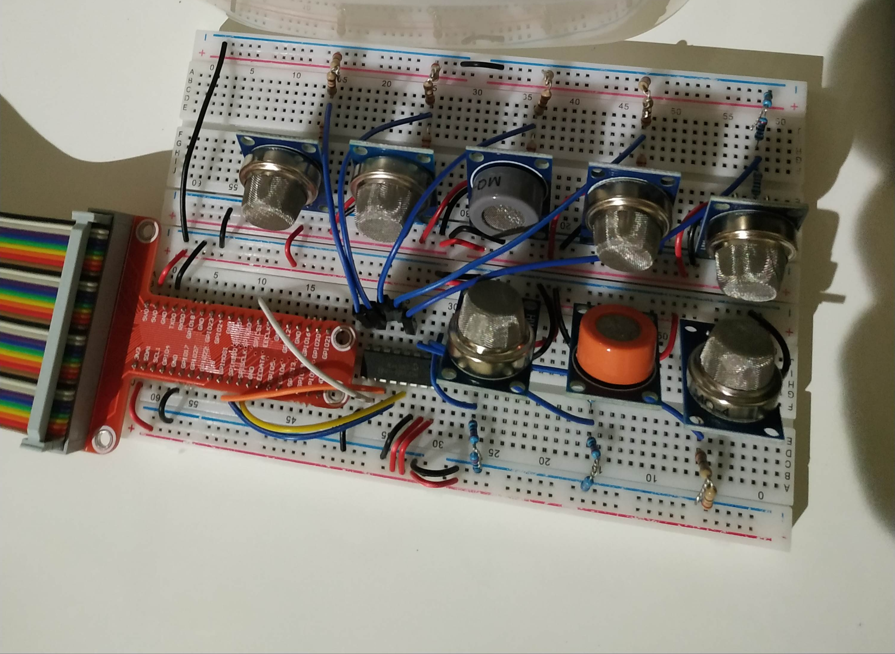
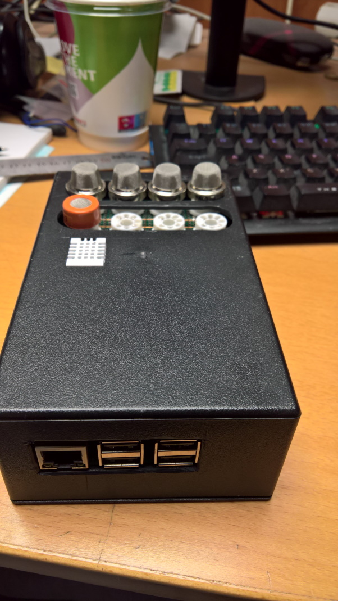

# Raspberry-to-assess-food-quality

This is an effort to assess food quality with the help of single board computers.

**Breadboard with 8 sensors.**

Sensors used in this experiment:

[MQ-2](https://github.com/farmaker47/Raspberry-to-assess-food-quality/blob/main/pdf/MQ-2.pdf),
[MQ-3](https://github.com/farmaker47/Raspberry-to-assess-food-quality/blob/main/pdf/MQ-3.pdf),
[MQ-4](https://github.com/farmaker47/Raspberry-to-assess-food-quality/blob/main/pdf/MQ-4.pdf),
[MQ-135](https://github.com/farmaker47/Raspberry-to-assess-food-quality/blob/main/pdf/MQ-135.pdf),
[MQ-6](https://github.com/farmaker47/Raspberry-to-assess-food-quality/blob/main/pdf/MQ-6.pdf),
[MQ-7](https://github.com/farmaker47/Raspberry-to-assess-food-quality/blob/main/pdf/MQ-7.pdf),
[MQ-8](https://github.com/farmaker47/Raspberry-to-assess-food-quality/blob/main/pdf/MQ-8.pdf),
[MQ-9](https://github.com/farmaker47/Raspberry-to-assess-food-quality/blob/main/pdf/MQ-9.pdf)

**Open the ml folder to use a cloab notebook along with the .csv file**

More info at the [Medium](https://farmaker47.medium.com/detecting-food-quality-with-raspberry-and-tensorflow-c18f661d5c1d) blog post.
